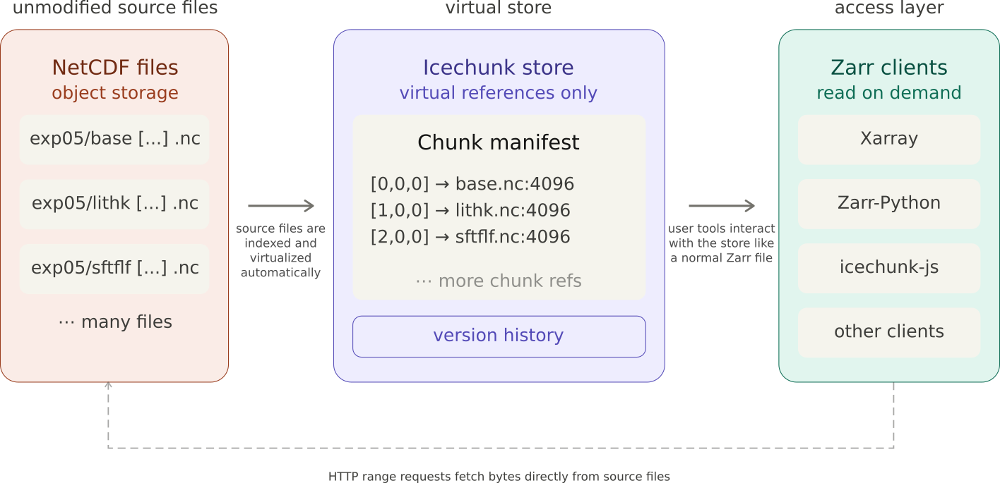

# ISMIP 6 Virtualization Pipeline

[](https://mybinder.org/v2/gh/englacial/ismip-indexing/main?urlpath=lab/tree/notebooks)

This repository is used to build a "virtualized" cloud-ready version of the Ice-Sheet Model Intercomparison for CMIP 6 (ISMIP 6) model outputs. To learn more about ISMIP, visit https://www.ismip.org/

The base of the repository is `virtualize_ismip6`, which contains the processing pipeline to take the original unmodified NetCDF files.



TL;DR: Browse the data at [englacial.org/static/models/](https://englacial.org/static/models/), or read more at [englacial.org/models.html](https://englacial.org/models.html).

If you're interested in **using** this ISMIP 6 dataset, there are a couple of options:

1. Check out the online ISMIP 6 viewer here: https://englacial.org/static/models/ (source repository here: https://github.com/englacial/ismip-viewer)
2. Try accesing the data through Xarray or your favorite Zarr library. To get started, check out the [`notebooks/`](./notebooks/) folder for some starting examples.

### Accesing the virtualized ISMIP 6 dataset with Xarray

There's some boilerplate code to open the dataset. Don't worry - you can just copy and paste this part.

```
SOURCE_BUCKET = "s3://us-west-2.opendata.source.coop/englacial/ismip6"

storage = icechunk.s3_storage(
    bucket="us-west-2.opendata.source.coop",
    prefix="englacial/ismip6/icechunk-ais",
    region="us-west-2",
    anonymous=True,
)

config = icechunk.RepositoryConfig.default()
config.set_virtual_chunk_container(
    icechunk.VirtualChunkContainer(
        SOURCE_BUCKET + "/",
        store=icechunk.s3_store(region="us-west-2", anonymous=True),
    )
)
credentials = icechunk.containers_credentials({SOURCE_BUCKET + "/": None})

repo = icechunk.Repository.open(
    storage=storage,
    config=config,
    authorize_virtual_chunk_access=credentials,
)
session = repo.readonly_session(branch="main")
```

Once you've got it open, you can load data like this:

```
ds = xr.open_zarr(session.store, group="combined/JPL1_ISSM/exp05", consolidated=False)
```

Keep reading for more details, or check out the notebooks to get started.

## More details

This repository contains tools for indexing, ingesting, and serving [ISMIP6](https://www.ismip.org/) Antarctic ice sheet model outputs. We are not associated with ISMIP. These are tools for publicly-available data that we hope are interesting and useful to the scientific community.

There are three main components:

1. **Ingest pipeline** ([`virtualize_ismip6/`](virtualize_ismip6/)) -- Virtualizes NetCDF source files into an [Icechunk](https://icechunk.io/) store using [VirtualiZarr](https://github.com/zarr-developers/VirtualiZarr) and [Lithops](https://lithops-cloud.github.io/) serverless functions on AWS Lambda.
2. **Python library** ([`ismip6_helper/`](ismip6_helper/)) -- Handles file indexing, grid correction, time encoding normalization, and ignore-value detection. You shouldn't need to use this! If you use our virtualized dataset, all the fixes are already encoded!
3. **Static indexing site** ([`ismip_data_index_website/`](ismip_data_index_website/)) -- Catalogs available outputs at [docs.englacial.org/ismip-indexing/](https://docs.englacial.org/ismip-indexing/).

The interactive web viewer lives in a separate repository: [englacial/ismip-viewer](https://github.com/englacial/ismip-viewer).

## Data

### Source files

A copy of the ISMIP6 outputs (originally [available through Globus](https://theghub.org/accessing-data-with-globus)) is hosted on source.coop:

```
s3://us-west-2.opendata.source.coop/englacial/ismip6/
```

Public, anonymous read access. No authentication required. For citation guidance, see the [ISMIP wiki](https://theghub.org/groups/ismip6/wiki/PublicationsCitationGuidance).

### Icechunk store

The ingest pipeline writes a virtualized Icechunk store to:

```
s3://us-west-2.opendata.source.coop/englacial/ismip6/icechunk-ais/
```

This store contains virtual references to chunks in the source NetCDF files -- no data is duplicated. It is organized into three top-level groups:

- **`combined/`** -- All variables merged per model+experiment, with time binned to annual resolution
- **`state/`** -- State variables only (e.g. `lithk`, `orog`, `base`), native time resolution
- **`flux/`** -- Flux variables only (e.g. `acabf`, `dlithkdt`), native time resolution

See [virtualize_ismip6/ICECHUNK_STORE.md](virtualize_ismip6/ICECHUNK_STORE.md) for details on the store structure and how the pipeline works.

### Data overview

- **10,034 files** (~1.1 TB total)
- **17 models** from 14 institutions
- **94 experiments**
- **37 variables**
- All Antarctic ice sheet (AIS) data

## Developers

### Setup

```bash
# Install dependencies
uv sync --extra dev

# Run unit tests
uv run --extra dev pytest ismip6_helper/tests/ virtualize_ismip6/tests/ -v -m "not integration"

# Run integration tests (builds local stores and compares against remote — takes ~20 min)
uv run --extra dev pytest virtualize_ismip6/tests/test_build_and_compare.py -v -m integration
```

### Running the ingest pipeline

The pipeline virtualizes source NetCDF files and writes them to the Icechunk store using Lithops on AWS Lambda:

```bash
# Build all three store types (combined, state, flux) on AWS Lambda
python virtualize_ismip6/virtualize_with_lithops_combine_variables.py \
    --config virtualize_ismip6/lithops_aws.yaml \
    --write-creds sc_creds.json

# Or build a specific store type
python virtualize_ismip6/virtualize_with_lithops_combine_variables.py \
    --config virtualize_ismip6/lithops_aws.yaml \
    --write-creds sc_creds.json \
    --store-type flux

# Local execution (useful for testing)
python virtualize_ismip6/virtualize_with_lithops_combine_variables.py \
    --config virtualize_ismip6/lithops_local.yaml \
    --local-storage --local-execution \
    --test-model PISM1 --test-experiment ctrl_proj_std
```

Note: the `sc_creds.json` input file is copied from source.coop as the temporary
credentials for write access.

See `python virtualize_ismip6/virtualize_with_lithops_combine_variables.py --help` for all options, and [virtualize_ismip6/lithops_aws.md](virtualize_ismip6/lithops_aws.md) for AWS infrastructure setup.

### Python API

**You probably shouldn't be using this directly! This library fixes small inconsistencies in the metadata of the original NetCDF files. The fixes are already encoded in the virtualized dataset.**

The `ismip6_helper` library provides utilities for working with ISMIP6 data:

```python
from ismip6_helper import get_file_index

# Get file index (cached locally)
df = get_file_index()

# Force rebuild from source bucket
df = get_file_index(force_rebuild=True)
```

Key modules:

- `index` -- File indexing and path parsing
- `grid_utils` -- Grid coordinate correction
- `time_utils` -- Time encoding normalization
- `merge_virtual` -- Union time axis computation and manifest padding
- `variable_classification` -- State/flux variable classification
- `ignore_value` -- Sentinel value detection and annotation
